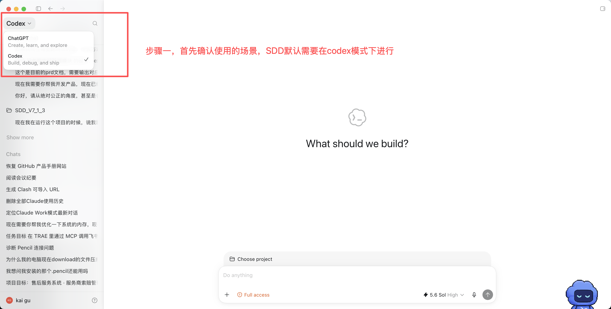
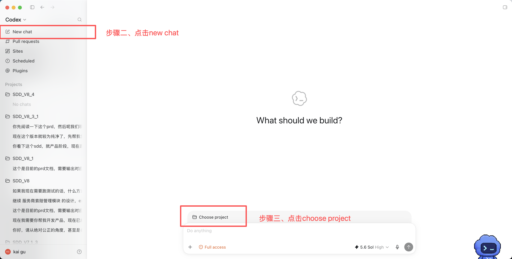
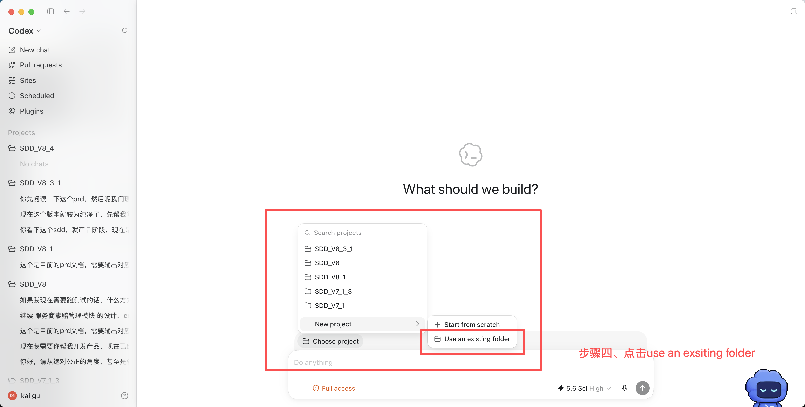
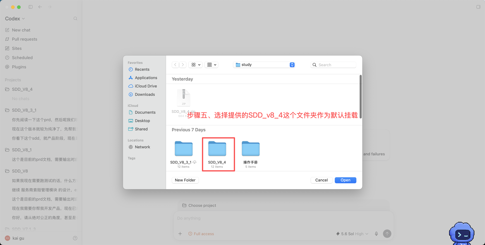

# SDD_V8_4 使用手册

> Spec-Driven Development · SDD_V8_4 —— 项目管理型、多平台 AI Coding Harness
> 适用入口：Codex / Claude Code / Cursor 三端
> 本手册面向使用者，讲清楚：这是什么、怎么用、有哪些角色、每个角色产出什么、产出物长什么样。

---

## 目录

1. [一句话定位](#1-一句话定位)
2. [核心概念](#2-核心概念先搞懂这几个词)
3. [快速上手](#3-快速上手你只需要说人话)
4. [全流程全景图](#4-全流程全景图)
5. [角色区分（人 + Agent）](#5-角色区分人--agent)
6. [节点逐个讲：职责 + 产出物 + 示例](#6-节点逐个讲职责--产出物--示例)
7. [产出物总清单](#7-产出物总清单谁产谁审存哪)
8. [门禁与硬规则](#8-门禁与硬规则不满足就走不下去)
9. [常见操作手册](#9-常见操作手册)
10. [三级经验系统](#10-三级经验系统)
11. [技术栈支持边界](#11-技术栈支持边界)

---

## 1. 一句话定位

> **V5 是“项目内的开发规范包”，SDD_V8_4 是“管理多个项目的 AI 研发流水线”。**

SDD_V8_4 不再默认“当前文件夹就是项目”。它先管理一个项目仓库 `Projects_Repo/`，再按你的意图进入六大分支之一，然后在单个项目里跑完整的**PRD 审计与延展 → 产品设计 → 多 Agent 开发 → 测试 → 修复**流水线，并把经验沉淀下来复用。默认从用户上传的半成品 PRD 开始；只有用户明确没有 PRD 时，才走从零生成初稿的低频入口。

它最核心的设计思想是**两侧接力 + 冻结合同**：

- **产品侧**以用户的半成品 PRD 为底稿做审计、补齐和设计延展；低频场景也支持从零生成 PRD 初稿，最终逐条确认功能点并“冻结”。
- **研发侧**拿着冻结好的合同只读实现，绝不回头改需求。
- 中间用一份 `docs/feature-signoff.md`（功能点确认书）作为**唯一交接合同**。

这样保证：设计不会在写代码时被偷偷篡改，代码不会实现没确认过的东西。

---

## 2. 核心概念（先搞懂这几个词）

| 概念 | 含义 |
|------|------|
| **Harness 根目录** | 你打开的这个仓库根。只放规则和适配，**不放业务代码**。 |
| **`harness-core/`** | 唯一真相源。所有流程规则、角色定义、开发规范都在这。 |
| **`.claude/` `.codex/` `.cursor/`** | 平台适配层。只做"入口翻译"，不复制流程。 |
| **`Projects_Repo/<project-id>/`** | 所有业务项目都放这里，一个项目一个目录。 |
| **`docs/`** | 项目的**设计文档**（PRD、原型、接口契约、详细设计…）。 |
| **`.sdd/`** | 项目的**状态大脑**（任务、状态机、经验、日志、测试报告、审计报告）。 |
| **两侧接力** | 产品侧（设计域）和研发侧（执行域）分离，可换人、换会话。 |
| **冻结合同** | `docs/feature-signoff.md`，产品侧交给研发侧的唯一凭证。 |
| **门禁（gate）** | 每个阶段结束必须由用户确认才能进下一步；不满足条件就卡住。 |

**Router（路由器）**：你在三端的任何入口，最终都汇聚到 `harness-core/router.md`。它负责读注册表、确定当前活动项目、判断你的意图、路由到正确分支。你不需要背命令——**说人话就行**。

---

## 3. 快速上手（你只需要说人话）

SDD_V8_4 **几乎不用手动命令**。你用自然语言表达意图，Router 自动分发到六大分支：

| 你想做的事 | 你可以这么说 | 进入的分支 |
|-----------|-------------|-----------|
| **基于半成品 PRD 启动（默认）** | “我上传了 PRD，请基于它启动 SDD” | ① 新建项目 · PRD 审计与延展 |
| 只有想法、没有 PRD（低频） | “我还没有 PRD，请从零帮我梳理” | ① 新建项目 · PRD 初稿生成 |
| 改已有项目的设计 | "改需求 / 加个功能的设计 / 调整接口契约" | ② 设计修整 |
| 把老代码纳入管理 | "把这个已有项目接入 SDD / 导入这个代码库" | ③ 导入项目 |
| 不要某个项目了 | "删除项目 / 这个项目不要了" | ④ 删除项目 |
| 开始写代码 | "开始开发 / 继续开发 / 接手这个项目" | ⑤ 开始/继续开发 |
| 修已交付功能的 Bug | "修一下这个 bug" | ⑥ Bugfix |

唯一保留的手动命令是 `/sdd-bugfix`（Claude Code / Codex / Cursor 均有适配）。

> 如果意图不清楚，Router 只会问你一句：**"你现在是产品侧的事，还是研发侧的事？"**

---

## 4. 全流程全景图

```
【产品经理 · 产品侧】
   R  读取半成品 PRD + 需求澄清 + 竞品调研 + 视觉证据
   → A  PRD 审计与补全（低频：从零生成初稿）+ 数据契约 + 外部依赖(A5-3)
   → B1 Design Spec（设计规格）
   → B2 原型（HTML / Pencil，用户验收）
   → C  PRD 定稿
   → D  后端详细设计 LLD（★条件触发：多表事务/状态机/资源匹配/既有库扩展/编码规则）
   ─────────────────── 产品交接点（git push → 组长 pull）───────────────────
【研发组长 · 产品侧尾段】
   → E  接口契约（E1 生成 → E2 独立审计）
   → F  Plan.md 开发计划
   → G  测试用例（基于功能点拆解，测试数据留空 → G-audit 独立审计）
   → 决策清零 → feature-signoff 功能点确认书【冻结】★唯一交接合同
   ═══════════════════════ 冻结合同 ═══════════════════════
【开发侧 · 研发侧】
   → Planner  拆任务 .sdd/tasks.md
   → Developer 写代码
   → Tester    独立验证
   → 用户门禁验收 → E2E 回归 → 交付
```

**独立审计员 design-auditor 贯穿关键节点**（有罪推定、只审不改、专抓幻觉与遗漏）：
- **A0.5**：阶段 A，对原始 PRD 盲扫独立审
- **D3.5**：阶段 D，对着 PRD 审 LLD
- **E2**：阶段 E，对着 LLD 审接口契约
- **G-audit**：阶段 G，审测试用例可溯性与防幻觉

> **阶段字母就是真实执行顺序**：R→A→B1→B2→C→(D)→E→F→G→冻结。注意接口契约(E)、Plan(F)、测试用例(G) 都在产品交接点**之后**由研发组长生成，命中 D 的项目在 D 之前根本不存在这些文件。

---

## 5. 角色区分（人 + Agent）

SDD_V8_4 不是一个角色端到端跑完。它把工作切成"人负责拍板、Agent 负责执行"。

### 人侧角色

| 角色 | 负责什么 | 在哪个环节拍板 |
|------|---------|--------------|
| **产品经理** | 需求与设计的负责人 | R→A→B1→B2→C 全程，D 决策拍板 |
| **研发组长** | 接口契约 / Plan / 测试用例 / 冻结签署 | E / F / G / 冻结，研发侧开发的最终负责人 |
| **底层研发** | 研发侧会话的操作者（驱动流程、过门禁、处理阻塞） | 开发执行 |
| **业务方 / 用户** | 需求来源与最终验收人 | 每个功能闭环的用户门禁 |

> 同一个人可以兼多个角色（产品兼组长、组长兼底层研发都常见）。但**不能在完成产品工作的同一轮里自动切成研发组长**——必须由后续新的用户轮次显式接棒。这是硬门禁。

### Agent 角色

| Agent | 身份 | 职责 | 关键原则 |
|-------|------|------|---------|
| **主会话（Orchestrator）** | 编排者 | 产品侧各阶段的执行者；研发侧编排 Planner→Developer→Tester | **绝不在主会话直接写功能代码**绕过角色边界 |
| **Planner** | 技术方案设计 | 把 PRD/Plan 拆成可执行任务状态机 `.sdd/tasks.md` | 验收标准要让非技术用户能从页面看懂 |
| **Developer** | 代码实现 | 按任务写代码，一次只做一个任务 | 只写满足需求的最小代码；严守规范 |
| **Tester** | 独立验证 | 不信任 Developer 的任何声明，逐条独立验收 | 只信可复现证据；范围收敛不发散 |
| **design-auditor** | 独立审计员 | A0.5 / D3.5 / E2 / G-audit 四道审计 | 有罪推定，只审不改，不看生成过程 |

**关键边界**：Agent 是执行工具，**不承担最终拍板（Accountable）**——每个环节的拍板人必须是人。

---

## 6. 节点逐个讲：职责 + 产出物 + 示例

下面按流程顺序，逐个节点讲清楚：**做什么、产出什么文件、文件长什么样**。

---

### 阶段 R — 需求澄清 + 竞品调研

- **谁做**：主会话（产品经理拍板）
- **做什么**：默认先读取用户上传的半成品 PRD，识别其中已经明确的业务目标、范围、场景和验收口径，再集中澄清缺口、矛盾与假设；调研竞品并沉淀视觉证据。只有用户明确没有 PRD 时，才从口述想法开始梳理。
- **产出物**：需求澄清结论（合并进 PRD，一般不单独建文件）；如涉及大功能，落 `docs/澄清文档/<feature>/01-alignment.md`

**产出物示例（alignment 澄清文档）**：
```markdown
# 智能客服工单系统 — 需求对齐

## 业务目标
让员工能自助向 AI 提问，AI 无法解决时转人工坐席工单。

## 范围
- 本期做：员工端提问、AI 回答、转工单、坐席接单、知识库上传
- 本期不做：多租户隔离、坐席绩效报表（V2+）

## 关键场景
1. 员工登录 → 提问 → AI 回答 → 不满意 → 转人工
2. 坐席在待处理池接单 → 对话 → 关单

## 验收口径
- "AI 回答" = 命中知识库返回，未命中则提示转人工
```

---

### 阶段 A — PRD 审计与补全 + 数据契约 + 外部依赖

- **谁做**：主会话（产品经理拍板）
- **做什么**：默认保留半成品 PRD 的原意和可追溯结构，先做 A0.5 盲审，再补齐 A1→A5 缺失内容；核心是**数据契约确认清单**和**接口响应格式契约**，A5-3 登记所有外部依赖（LLM/支付/短信/对象存储等供应商、密钥来源、配置字段）。只有用户明确没有 PRD 时，才在本阶段从零生成 PRD 初稿，然后进入同样的审计与补全流程。
- **产出物**：`docs/PRD.md`（含完整数据契约章节）
- **独立审计**：⭐ 默认入口触发 **A0.5** —— design-auditor 用 BLIND 模式只喂原始 PRD+泳道图+原型独立盲扫，禁喂需求摘要/决策表，抓假确认点和漏掉的真矛盾。从零生成初稿的低频入口，在初稿形成后再进入后续审计。

**产出物示例（PRD 数据契约片段）**：
```markdown
## 数据契约确认清单

| 实体 | 字段 | 类型 | 必填 | 约束 |
|------|------|------|------|------|
| 工单 | ticket_id | string | 是 | 雪花ID |
| 工单 | status | enum | 是 | 待处理/处理中/已关闭 |
| 工单 | content | text | 是 | ≤2000字 |

## 接口响应格式契约（A5-2 锁定）
所有响应统一 Result<T>：
{ "success": true, "code": 0, "message": "", "data": {...}, "traceId": "..." }

## A5-3 外部依赖
| 服务 | 供应商 | 配置字段 | Key 来源 | 降级 |
|------|-------|---------|---------|------|
| LLM | 阿里百炼 | BAILIAN_API_KEY | 运维提供 | 可Mock |
```

---

### 阶段 B1 — Design Spec（设计规格）

- **谁做**：主会话（产品经理拍板）
- **做什么**：确立设计上下文与视觉规格（配色、字体、间距、组件规范），为原型打基础。
- **产出物**：`.sdd/tmp/ui-design-spec.md`（临时规格，B2 完成后归档）

---

### 阶段 B2 — 原型（用户验收）

- **谁做**：主会话（产品经理拍板，业务方看效果）
- **做什么**：选择原型架构（HTML / Pencil / Stitch），产出高保真原型并让用户验收。
- **产出物**：`docs/prototypes/`（HTML 原型或 Pencil/Excalidraw 文件）
- **重要**：原型是**研发侧写前端的唯一文案/样式依据**。Developer 必须逐字对齐原型，Tester 会逐字校验，任何不一致直接 FAIL。

---

### 阶段 C — PRD 定稿

- **谁做**：主会话（产品经理拍板）
- **做什么**：补齐路线图、技术架构蓝图、原型说明、核心流程图，把 PRD 定稿。到达**产品交接点**。
- **产出物**：`docs/PRD.md`（定稿版）
- **交接点动作**：写 `.sdd/status.json` 为 `handoff_status="AWAITING_DEV_LEAD"`，输出固定交接通知，**当前轮强制结束**。等研发组长在新轮次显式接手。

---

### 阶段 D — 后端详细设计 LLD（★条件触发）

- **谁做**：主会话（产品经理拍板决策，研发组长审定 schema）
- **触发条件**（命中任一）：多表事务级联 / 显式状态机 / 资源匹配调度 / 基于既有 DB schema 扩展 / 单据编码规则。绿地简单 CRUD **不触发**，直接进 E。
- **做什么**：字段级数据来源映射、状态机、操作副作用事务序列、编码规则、并发/回滚设计；先完成 `docs/db-schema/`（既有库=纳管登记，绿地=建表 SQL 设计）。
- **产出物**：
  - `docs/detail-design/详细设计-<功能>.md`（LLD）
  - `docs/db-schema/`（表结构文档 + `ddl/` 建表 SQL，全项目共享一份）
  - `.sdd/traceability/<功能编码>.md`（双向可溯矩阵）
  - `docs/decisions/待确认决策表-<模块>.xlsx`（待产品逐条拍板）
- **独立审计**：⭐ **D3.5** —— design-auditor 喂 PRD+LLD+schema+矩阵，逐条抓幻觉（无据/强化/调和/假确认）和遗漏，PASS 才能往下。

**产出物示例（LLD 状态机 + 副作用片段）**：
```markdown
## 状态机：工单
| 当前态 | 事件 | 目标态 | 前置条件 |
|-------|------|-------|---------|
| 待处理 | 坐席接单 | 处理中 | 坐席在线且未满负荷 |
| 处理中 | 关单 | 已关闭 | 当前坐席=接单坐席 |

## 操作副作用：坐席接单
| 表 | 列 | 写入值 |
|----|----|-------|
| t_ticket | status | 处理中 |
| t_ticket | agent_id | 当前坐席ID |
| t_ticket | version | +1（乐观锁）|
| t_agent_load | current_count | +1 |
| t_ticket_log | action | INSERT "接单" |
```

**产出物示例（待确认决策表）**：8 可见列 + 1 隐藏机器列，由工具 `generate.py` 从 registry 派生（禁止手搓）：

| 编号 | 类别 | 涉及节点 | 描述（冲突/未定义） | 处理建议 | 产品决策 | 状态 | 决策人/备注 |
|------|------|---------|-------------------|---------|---------|------|-----------|
| D-工单-B2 | 调和 | 工单状态 | PRD 表15 有"待市场审核"，按钮逻辑没有 | 恢复该状态，"谁审"待拍板 | *(留空)* | 待确认 | *(留空)* |

> 编号格按风险配色（HIGH 红 / MEDIUM 黄 / LOW 绿）。HIGH 必须逐条确认，不能"都按推荐"批量覆盖。

---

### 阶段 E — 接口契约（研发组长执行）

- **谁做**：主会话（研发组长拍板）
- **前提**：研发组长已在新轮次显式接手（跨过角色交接门禁）。
- **做什么**：E1 基于已确认的 LLD + schema 派生接口契约（不凭空生成）。
- **产出物**：`docs/api-contracts.md`
- **独立审计**：⭐ **E2** —— design-auditor 喂 LLD+api-contracts+schema，逐接口查"是否胡编"（每个接口/字段都要在 LLD 找到依据）和"是否满足设计"（LLD 每个操作都要有接口覆盖）。PASS 才往下。

**产出物示例（接口契约片段）**：
```markdown
### POST /api/tickets/{id}/accept  坐席接单
**请求**：Header Authorization: Bearer <token>
**响应** Result<TicketDTO>：
{ "success": true, "code": 0, "data": {
    "ticketId": "...", "status": "处理中", "agentId": "..." } }
**业务处理逻辑**（对齐 LLD 副作用）：
1. 校验坐席在线且未满负荷（否则 409）
2. t_ticket.status → 处理中，agent_id 带入，version +1
3. t_agent_load.current_count +1
4. t_ticket_log 插入"接单"记录
**错误码**：409 坐席已满 / 404 工单不存在 / 401 未登录
```

---

### 阶段 F — Plan.md 开发计划（研发组长执行）

- **谁做**：主会话（研发组长拍板）
- **做什么**：产出开发计划，列全功能清单、依赖关系、优先级、**外部服务与测试权限清单**。
- **产出物**：`docs/Plan.md`

---

### 阶段 G — 测试用例（研发组长执行）

- **谁做**：主会话（研发组长拍板）
- **做什么**：基于已确认功能点**拆解**测试用例（不是需求再创作）。
- **产出物**：`docs/test-cases/测试用例[-<模块>].xlsx`，统一 14 列
- **两条硬规则**：① 每条用例必须映射到功能编号，无孤儿用例（防幻觉）；② **「测试数据」列一律留空**（设计阶段不预置具体数据值）。
- **独立审计**：⭐ **G-audit** —— design-auditor 查每条可溯功能点、无编造字段/状态/文案、测试数据列为空、关键功能点异常/边界覆盖、无漏测。

**产出物示例（测试用例行，14 列节选）**：

| 用例ID | 测试功能点 | 测试标题 | 角色 | 前置条件 | 测试数据 | 测试步骤 | 预期结果 | 优先级 | 执行状态 | 备注 |
|--------|-----------|---------|------|---------|---------|---------|---------|--------|---------|------|
| TC001 | F-03-02 | 坐席接单（正向） | 坐席 | 存在待处理工单 | *(留空)* | 1.进池 2.点接单 | 1.工单入处理中列表 | P0 | 待执行 | feature=F-03-02; 依据=api:POST /accept |
| TC002 | F-03-02 | 坐席接单（异常-已满） | 坐席 | 坐席负荷已满 | *(留空)* | 1.点接单 | 1.提示"已满"，工单不变 | P1 | 待执行 | 依据=LLD状态机前置 |

---

### 冻结 — feature-signoff 功能点确认书

- **谁做**：主会话（研发组长组织，产品经理/用户逐条确认）
- **做什么**：逐条把功能点连同 PRD章节/原型/接口/LLD/测试用例链接列全，**请用户逐条确认冻结**。每个功能点必须已登记 ≥1 条测试用例覆盖。
- **产出物**：`docs/feature-signoff.md`（唯一交接合同）
- **冻结门禁**：填冻结版本 / 时间 / 确认人 / 冻结 commit；核对所有文档头部版本号一致；决策表全部决策完毕；测试用例 G-audit PASS。任一不满足不得冻结。

**产出物示例（功能点确认清单）**：

| 功能编码 | 功能点 | 对应页面 | PRD章节 | 原型 | api接口 | 详细设计 | 产品确认 |
|---------|--------|---------|---------|------|---------|---------|---------|
| F-03-02 | 坐席接单 | P05 | §3.2 | prototypes/agent.html | POST /accept | 详细设计-工单.md | ✅ |

> ⚠️ 第四节「变更登记」表初始**只有表头、无数据行**——预填空行会被研发侧误判为"合同变更中"而阻塞开发。

---

### 研发侧 — Planner → Developer → Tester

冻结完成后，换人/换会话说"开始开发"进入研发侧。主会话作为 Orchestrator 编排三个子 Agent。

#### Planner（拆任务）

- **产出物**：`.sdd/tasks.md`（任务状态机，唯一进度文件）
- **拆分逻辑**：前端 Mock 先行 → 后端基础设施（自动） → 逐功能闭环（逐个门禁） → E2E 回归。
- **核心规则**：验收标准分两层——`acceptanceCriteria`（用户可见，从前端页面视角写）和 `technicalChecks`（Agent 自动跑，typecheck/lint/`mvn verify`）。

**产出物示例（tasks.md 任务分节）**：
```markdown
## T-003 · 坐席接单功能
- 类型：integration ｜ 优先级：3 ｜ 用户门禁：是
- 功能编码：F-03-02 ｜ 依赖：T-002
- 状态：pending ｜ retry_count：0
- 描述：后端真实接单API + 前端坐席端Mock切真实 + 状态同步
- 验收标准（用户可感知）：
  1) 坐席在待处理池点接单，工单进入"处理中"列表
  2) 员工端实时收到"坐席接入"通知
- 技术检查：$MVN -q verify 通过；前端 VITE_USE_MOCK=false 走真实API
- 规则文件：dev-standards/backend-java.md, dev-standards/frontend.md
```

#### Developer（写代码）

- **产出物**：代码文件（backend / frontend）+ `.sdd/experience.md` 经验追加
- **四原则**：先想清楚再写、从最简单方案开始、手术刀式精确修改、目标驱动。
- **输出**：只返回修改/新增的文件路径列表，不返回代码内容；一次只做一个任务。

#### Tester（独立验证）

- **产出物**：`.sdd/test-reports/test-<task-id>.md`（测试报告，覆写）+ `.sdd/bug-logs/<task-id>.md`（BUG 日志，只追加）
- **核心原则**：不信任 Developer 任何声明，逐条独立验收；只信可复现证据。
- **三种判定**：PASS（通过）/ FAIL（代码缺陷，进返修）/ BLOCKED（环境阻塞，非代码问题）。

**产出物示例（测试报告）**：
```markdown
# 测试报告：T-003 坐席接单功能
## 结果：FAIL
## 验收标准逐条验证
| # | 标准 | 结果 | 说明 |
|---|------|------|------|
| 1 | 点接单工单进处理中列表 | PASS | 联调命中真实 /api/accept |
| 2 | 员工端实时收到通知 | FAIL | WebSocket 未推送，见下 |
## 问题 1
- 现象：接单后员工端无推送
- 位置：TicketService.java:88（漏调 pushService）
- 建议修复方向：接单成功后调用 push
```

---

## 7. 产出物总清单（谁产、谁审、存哪）

| 阶段 | 产出物 | 路径 | 谁产 | 谁审 |
|------|--------|------|------|------|
| A | PRD 审计与补全（低频：初稿生成） | `docs/PRD.md` | 产品经理/主会话 | A0.5（半成品 PRD 默认触发）|
| B2 | 原型 | `docs/prototypes/` | 主会话 | 用户验收 |
| D | 后端详细设计 LLD | `docs/detail-design/详细设计-<功能>.md` | 主会话 | **D3.5** |
| D | 表结构 + 建表SQL | `docs/db-schema/`（+ `ddl/`）| 研发组长审定 | D3.5 |
| D | 双向可溯矩阵 | `.sdd/traceability/<编码>.md` | 主会话 | design-auditor 交叉核对 |
| D | 待确认决策表 | `docs/decisions/待确认决策表-<模块>.xlsx` | `generate.py` 派生 | 产品逐条拍板 |
| E | 接口契约 | `docs/api-contracts.md` | 研发组长/主会话 | **E2** |
| F | 开发计划 | `docs/Plan.md` | 研发组长/主会话 | — |
| G | 测试用例 | `docs/test-cases/测试用例.xlsx` | 研发组长/主会话 | **G-audit** |
| 冻结 | 功能点确认书 | `docs/feature-signoff.md` | 研发组长组织 | 用户逐条确认 |
| 开发 | 任务状态机 | `.sdd/tasks.md` | Planner | 用户确认清单 |
| 开发 | 代码 | `backend/` `frontend/` | Developer | Tester |
| 开发 | 测试报告 | `.sdd/test-reports/` | Tester | — |
| 开发 | BUG 日志 | `.sdd/bug-logs/` | Tester（只追加）| Developer 修复前必读 |
| 审计 | 设计审计报告 | `.sdd/design-audit/` | design-auditor | — |
| 交付 | 启动文档 | `docs/startup.md` | Orchestrator | — |
| 全程 | 项目经验 | `.sdd/experience.md` | 各子 Agent | — |
| 全程 | 系统经验 | `<harness根>/memory/harness-experience.md` | Orchestrator 回传 | 组长确认升级 |

> **多模块大项目**：产品文档按模块分文件，命名一律"类型-模块"前缀式，如 `docs/PRD/PRD-<模块>.md`、`docs/api-contracts/接口文档-<模块>.md`；`docs/db-schema/` 全项目共享一份。

---

## 8. 门禁与硬规则（不满足就走不下去）

### 开发门禁（进入多智能体开发前，11 条全满足）

1. `docs/PRD.md` 存在
2. `docs/api-contracts.md` 存在
3. `docs/prototypes/` 存在（或用户明确放弃原型）
4. `docs/Plan.md` 存在
5. `.sdd/tasks.md` 存在（首次由 Planner 生成）
6. 已对齐运行时（JDK 17+ / Maven 3.9+ / Node 18+ / MySQL 或 PostgreSQL）
7. 外部依赖与配置草稿已确认（或明确选 Mock/降级）
8. 命中阶段 D 的项目：LLD 完成 + D3.5 与 E2 双双 PASS + 用户确认 + `db-schema/` 就位
9. 测试用例已产出（G-audit PASS，测试数据列为空）
10. **产品设计已冻结**（`feature-signoff.md` 逐条确认）
11. 用户明确表示开始/继续开发

### 角色交接硬门禁（优先级最高）

```
角色边界门禁 > 阶段切换协议 > "继续/可以/确认/按方案执行"
```

产品交接点后，**不能在同一轮自动切成研发组长**。必须由后续新的用户轮次显式说"研发组长接手 / 以研发组长身份继续 / 继续 <项目名> 的设计"才算接棒。产品决策回复、"可以"、"确认"一律不算。

### 冻结保护约束（研发侧铁律）

研发侧**只读消费**设计文档，禁止修改 PRD / 原型 / api-contracts / detail-design / db-schema / test-cases / feature-signoff。发现设计缺陷 → 停下，回产品侧走「变更登记」重新冻结，绝不私自改。研发侧唯一可写的 docs 文件是 `docs/startup.md` 和 `docs/Plan.md` 的任务状态列。

---

## 9. 常见操作手册

### 首次使用：在 Codex 中挂载 SDD_V8_4

SDD_V8_4 是一套本地 Harness。第一次使用时，要先把解压后的 SDD_V8_4 文件夹作为现有项目挂载到 Codex。完成一次后，后续直接在左侧 Projects 中进入该项目并新建任务即可。

1. 点击左上角模式菜单，确认当前选择的是 **Codex**，不是 ChatGPT。
2. 点击左侧 **New chat** 新建任务。
3. 点击输入框上方的 **Choose project**。
4. 选择 **New project → Use an existing folder**，不要选择 Start from scratch。
5. 在文件选择器中选中解压后的 **SDD_V8_4** 文件夹，然后点击 **Open**。









> **不要挂载业务项目子目录。** 应挂载包含 `harness-core/`、`.codex/` 和 `Projects_Repo/` 的 SDD_V8_4 根目录。挂载后，业务项目仍由 SDD 在 `Projects_Repo/` 中统一管理。

### 用 Codex 跑 SDD：先记住这 5 件事

1. **打开 Harness 根目录**：Codex 的工作目录必须是 SDD_V8_4 根目录，不要只打开某个业务项目子目录。
2. **一个任务只承担一个明确角色**：产品经理、研发组长、研发执行建议分别开 Codex 新任务；至少要用新的用户消息明确交接身份，不能让 Agent 在同一轮里自行换角色。
3. **默认先上传半成品 PRD**：让 Codex 从 PRD 中识别项目名称、目标、范围和功能点；用户只补充材料里没有的信息，不需要重新填写一份项目表单。
4. **门禁回复要写结论**：说清楚“确认哪些、修改哪些、哪些仍待确认”。角色交接时只说“继续 / 可以”不算接棒。
5. **提交前先看差异和验证结果**：让 Codex 先报告改动文件、测试结果和风险；你确认后再 commit / push。

Codex 官方建议复杂任务的提示词交代目标、上下文、约束和完成标准。下面的模板已把这些内容预置好，用户通常只需上传 PRD，再补一句特别要求；不要求逐项填写四要素。

| 提示词要素 | 在 SDD 里写什么 |
|-----------|----------------|
| **目标 Goal** | 模板预置为 PRD 审计与延展、续做、开发、变更、Bugfix 或导入 |
| **上下文 Context** | 优先由 Codex 从上传的 PRD、截图、日志和仓库状态中识别 |
| **约束 Constraints** | 角色边界、冻结保护、不可猜测项、技术栈或时间范围 |
| **完成标准 Done when** | 模板预置当前门禁和停止条件，用户只需确认或纠正 |

### 第一次进入：先做环境与路由自检

新开 Codex 任务后，先发这段。它只确认环境，不应直接生成业务代码：

```text
请先确认当前工作目录是 SDD_V8_4 Harness 根目录，并读取仓库中的 Codex/SDD 入口规则与 harness-core/router.md。

请只报告：
1. 是否识别到 Harness 根目录；
2. 当前活动项目及其阶段（没有则明确说没有）；
3. 我接下来可以进入的 SDD 分支；
4. 当前存在的阻塞或缺失材料。

本轮不要创建项目、不要修改文件、不要开始开发。
```

### 标准流程提示词：从半成品 PRD 到交付

#### 1）默认入口：上传半成品 PRD 并启动

```text
请基于我上传的 PRD 启动 SDD_V8_4。

可选补充：[没有可删掉这一行]

请先从 PRD 中识别项目名称、目标用户、业务目标、范围和功能点，不要让我重复填写材料里已经有的内容。保留原文意图，先做需求审计与缺口分析；事实、假设、矛盾和待确认项分开列出，无法确认的内容集中问我。不要从零重写整份 PRD，未经我确认当前门禁不要进入下一阶段，也不要开始写业务代码。
```

#### 2）低频入口：只有想法、还没有 PRD

原来的 PRD 生成流程仍保留，但只在用户明确没有任何 PRD 时使用：

```text
我目前没有 PRD，只有下面这个想法，请按 SDD_V8_4 从阶段 R 开始梳理：

[用一两句话描述想法]

请先通过提问确认目标、用户和范围，再生成 PRD 初稿。事实、假设和待确认项必须分开；未经我确认当前门禁，不要进入下一阶段，也不要开始写业务代码。
```

#### 3）补充其它附件或强调重点

```text
这些附件也是当前 PRD 的补充材料，请一起读取。重点关注：[没有可删掉]。

请提取可以直接确认的事实；推断内容单独标记为“假设”；冲突、缺失或看不清的内容进入待确认清单。先给我材料解读摘要和待确认项，不要直接跨过当前门禁。
```

#### 4）回复阶段门禁

```text
阶段 [R/A/B1/B2/C/D/E/F/G] 的门禁结论如下：

确认通过：
- [已确认项]

需要修改：
- [修改项 + 正确结论]

仍待确认：
- [暂时不能拍板的项]

请只更新本阶段受影响的产物，给出修改摘要和新的门禁检查结果。仍待确认项未清零前不要进入下一阶段。
```

#### 5）换任务继续产品设计

```text
继续 [项目名 / project_id] 的设计。我现在以产品经理身份接手。

请先读取项目状态、已有产物和最近一次门禁记录，告诉我：当前阶段、已完成项、待确认项、下一步动作。不要重做已确认阶段；恢复上下文后停下来等我确认再继续。
```

#### 6）产品交接后，由研发组长显式接棒

产品经理完成交接后，**建议新开一个 Codex 任务**，再发送：

```text
以研发组长身份接手 [项目名 / project_id]，从产品交接点继续设计。

请先核验已有 PRD、原型、条件触发的详细设计和当前状态，只从 SDD 允许的下一阶段继续。按顺序完成 E 接口契约、E2 独立审计、F 开发计划、G 测试用例、G-audit 和 feature-signoff 冻结；每道用户门禁都要停下来等我确认，不要在本轮进入研发实现。
```

#### 7）设计冻结后开始开发

冻结完成后，**建议再开一个 Codex 新任务**：

```text
开始开发 [项目名 / project_id]。我现在以研发执行方身份接手。

请先校验 feature-signoff 冻结合同和全部开发门禁。设计文档只读，发现缺陷必须停止并报告，不能在研发侧私自修改。

门禁通过后，先由 Planner 读取 Plan、测试用例和项目经验，生成或恢复 .sdd/tasks.md，并把任务顺序、验收标准和风险给我确认。未经我确认任务清单，不要开始写功能代码。后续按 Developer → Tester 的独立循环逐任务推进。
```

#### 8）换任务继续开发

```text
继续开发 [项目名 / project_id]。请读取 .sdd/tasks.md、最近测试报告、未提交改动和项目经验恢复上下文。

先报告已完成任务、当前未完成任务、上次失败证据和下一步；从第一个未完成任务继续，不重跑产品设计，不修改冻结文档。每个任务必须经过独立测试并留下可复现证据。
```

#### 9）交付前检查、commit 和 push

```text
请做本轮交付检查：
1. 检查 git diff，确认没有误改冻结文档或无关文件；
2. 运行与改动范围匹配的测试、构建、lint 和类型检查；
3. 汇总变更文件、用户可见结果、验证证据和剩余风险；
4. 先把检查结果和建议的 commit message 给我，不要立即提交或推送。

等我明确确认后，再 commit 并 push 到当前远端分支；push 后返回 commit hash 和远端结果。
```

### 高频场景速查

### 我有半成品 PRD，要启动项目（默认）
上传 PRD 后说“请基于这份 PRD 启动 SDD_V8_4”。Router 进入 `sdd-product-design`，从材料中识别 project_id/name 和已有需求，创建目录骨架和 Git，先审计缺口再按 R→A→…推进。

### 我只有想法、还没有 PRD（低频）
说“我还没有 PRD，请从零帮我梳理”。仍进入 `sdd-product-design`，先通过提问澄清需求并生成 PRD 初稿，再接回同一套审计、门禁与冻结流程。这个入口仍保留，但不是默认推荐方式。

### 设计做到一半，换人接着做
在新会话说"继续 <项目名> 的设计"。走接续入口，跳过空项目检查，由 `status.json` 自动落到当前阶段（如产品交接点后组长接手会落到阶段 E）。

### 设计已冻结，我要开始写代码
说"开始开发"。Router 进入 `sdd-dev-execution`，校验冻结合同和开发门禁，通过后 Planner 拆任务，你确认清单，然后 Developer→Tester 循环。

### 换人/换会话接手开发到一半的项目
在新会话说"继续开发 / 接手这个项目"。读 `.sdd/tasks.md` + 测试报告 + 项目经验恢复上下文，从第一个未完成任务继续，不重跑设计。

### 我要改一个已冻结项目的需求
说"改需求 / 加个功能"。走 `sdd-project-maintenance`，必须走 feature-signoff「变更登记」，重新冻结受影响功能点。**研发侧不能借道设计修整改冻结文档。**

### 修一个已交付功能的 Bug
用 `/sdd-bugfix` 或说"修一下这个 bug"。可以改代码，但不改设计文档。设计缺陷不算 Bug，走变更登记。

推荐提示词：

```text
/sdd-bugfix [项目名 / project_id]

问题现象：[发生了什么]
复现步骤：[1、2、3]
预期结果：[应该怎样]
实际结果：[现在怎样]
影响范围：[用户/功能/数据]
证据：[日志、报错、截图、请求响应]

请先稳定复现并定位根因，再给出最小修复方案。只改代码和必要测试，不修改冻结设计文档；如果根因属于设计缺陷，停止并建议走变更登记。完成标准：复现用例转为通过、相关回归通过、给出验证证据和风险说明。
```

### 导入已有的老代码库
先把代码放到 `Projects_Repo/<id>/`，再说"导入这个项目"。Router 只补缺失的 `.sdd/` 脚手架，反向梳理 PRD/接口契约/Plan，不覆盖业务文件。

---

## 10. 三级经验系统

```
任务经验 → 项目经验 → 系统经验
```

| 级别 | 存哪 | 内容 |
|------|------|------|
| 任务经验 | 对话内 | 具体任务/bug 的局部经验 |
| 项目经验 | `.sdd/experience.md` | 当前项目长期有效的经验 |
| 系统经验 | `memory/harness-experience.md` | 跨项目可复用的 Harness 规则 |

**闭环**：进入开发时，Orchestrator 先读系统经验，挑出与当前项目相关的教训，随任务传给 Planner（回读环）；Tester FAIL 时若发现跨项目通用问题，回传系统经验（写回环）。经验可以上升，但必须带证据 + 人确认。

---

## 11. 技术栈支持边界

**研发侧自动开发循环（Planner→Developer→Tester）只支持默认栈**：

- 后端：JDK 17 / Spring Boot 3 / MyBatis-Plus / Maven（MySQL 8 或 PostgreSQL）
- 前端：React + TypeScript + Vite（桌面 Ant Design，H5/PWA Ant Design Mobile）

**其他栈**（Python / Go / Vue / 原生移动端 / 纯 CLI）：可以**导入纳管**（注册、补脚手架、反向整理设计、设计修整），但**不进自动开发循环**。要开发非默认栈，须先补对应 `dev-standards/` 规范并经维护者确认，或迁移到默认栈。

**前端目标默认支持**：桌面 Web、移动端 H5 / PWA。原生 App / React Native / Flutter / uni-app / 小程序**不在默认支持范围**，需补移动端专项规范。

---

> **一句话总结**：产品侧把设计做实、逐条冻结；研发侧拿冻结合同只读实现；独立审计员全程抓幻觉；三级经验持续进化。人拍板，Agent 执行，门禁把关。
