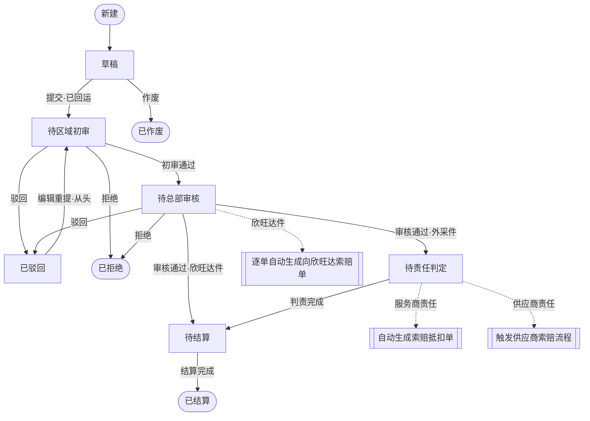
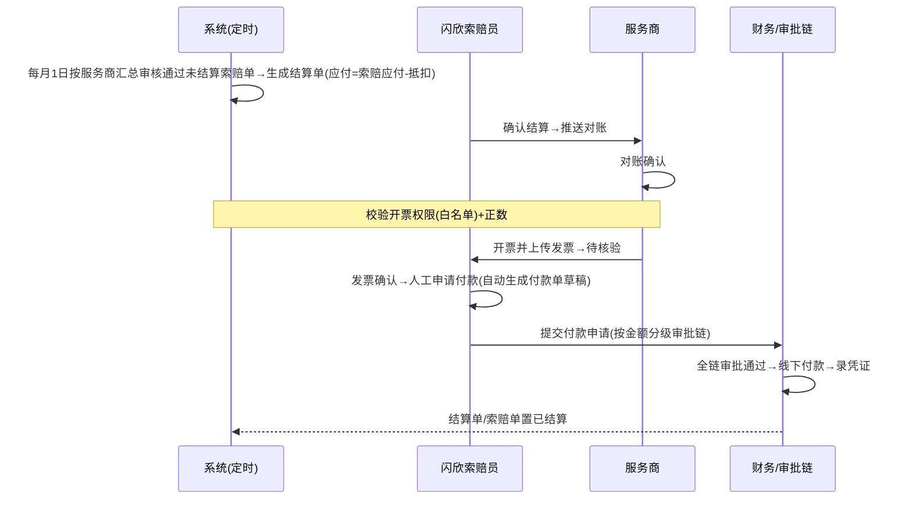

# 服务商索赔管理模块 · PRD

> 版本：V1.0（阶段 C 定稿 · 待 feature-signoff 冻结统一版本号）
> 来源：外部 PRD V1.0（吴娟 2026-04-05）+ 业务流程图，经 A0 稳定审读（门禁 PASS）与 40 条决策逐条确认后派生。
> 权威决策源：`docs/decisions/待确认决策表.xlsx`（已确认）/ `.sdd/decision-registry.json`。文末「决策落地登记」逐条映射。
> 技术栈：后端 JDK17 / Spring Boot 3 / MyBatis-Plus / MySQL8；前端 React+TS+Vite / Ant Design（桌面 Web 后台）。

---

## 1. 背景与目标

规范售后服务系统中**服务商保内维修索赔**全流程：索赔申请 → 多级审核 → 责任判定 → 服务商结算 → 向上游欣旺达索赔与结算 → 付款申请。解决线下流程不透明、权责不清、结算效率低、超范围索赔等问题，实现全链路数字化、合规可追溯。

**业务目标**：合规管控（仅保内工单可索赔、杜绝超范围/超权限）、数据可溯（全流程留痕）、权责清晰（按备件来源拆分处理）、上下游协同（打通向欣旺达索赔链路）。

**依赖既有模块**：维修工单管理（工单基础/状态/维修项目/工时/备件/主责件/系数）、用户与权限管理（RBAC）、服务商管理（服务商基础/区域）。**外部对接**见 S11 与 `docs/external-interfaces/待料清单.md`。

---

## 2. 角色与权限模型（RBAC）

| 角色 | 职责 | 数据范围 |
|---|---|---|
| 服务商售后专员 | 发起/编辑/提交/查看本店索赔单、结算对账、开票、上传发票 | 仅本服务商数据 |
| 区域负责人 | 所辖区域索赔单区域初审、录入索赔对象/项目编码 | 仅所辖区域 |
| 闪欣动力索赔专员 | 业务审核、生成/提交向欣旺达索赔单、结算确认、付款申请 | 全国全量 |
| 质量部责任判定专员 | 外采件责任判定 | 仅【待责任判定】外采件 |
| 欣旺达索赔专员 | 闪欣索赔单审批、闪欣结算确认/付款 | 全量闪欣索赔单（本期在本系统内建角色操作，见 EXT-02） |
| 财务人员（闪欣） | 付款审批链节点、质保金扣减、录付款凭证 | 按审批节点 |
| 索赔业务管理员 | 结算基础配置（周期/开票权限/审批流/索赔系数/付款金额档位） | 全局配置 |

权限管控三层：前端按角色渲染菜单/按钮；后端接口鉴权（401/403）+ 数据行级权限过滤；数据权限按角色+所属机构/区域过滤。

---

## 3. 页面清单与跳转

| 编号 | 页面 | 类型 | 可见角色 | 入口 |
|---|---|---|---|---|
| P01 | 服务商索赔单列表页 | 列表 | 服务商/区域/索赔专员/质量部 | 菜单 |
| P02 | 服务商索赔单 新建/编辑/详情页 | 表单/详情 | 同上（按状态与角色） | P01 |
| P03 | 闪欣向欣旺达索赔单 列表页 | 列表 | 索赔专员/欣旺达 | 菜单 |
| P04 | 闪欣索赔单 新建/编辑/详情页 | 表单/详情 | 索赔专员/欣旺达 | P03 |
| P05 | 服务商索赔结算单 列表页 | 列表 | 服务商/索赔专员 | 菜单 |
| P06 | 服务商索赔结算单 详情页 | 详情 | 服务商/索赔专员 | P05 |
| P07 | 闪欣索赔结算单 列表页 | 列表 | 索赔专员/欣旺达 | 菜单 |
| P08 | 闪欣索赔结算单 详情页 | 详情 | 索赔专员/欣旺达 | P07 |
| P09 | 付款申请单 列表页 | 列表 | 索赔专员/审批人 | 菜单 |
| P10 | 付款申请单 新建/编辑/详情页 | 表单/详情 | 索赔专员/审批人 | P09、P06 申请付款 |
| P11 | 结算基础配置页 | 配置 | 索赔业务管理员 | 菜单 |
| — | 审核弹窗 / 审批弹窗 / 导出弹窗 / 判责录入弹窗 / 发票上传弹窗 | 弹窗 | 按操作 | 各列表/详情 |

**关键跳转**：列表→详情（点编号/查看）；列表→新建/编辑（按状态+角色）；结算详情「申请付款」→付款单新建；付款/结算详情「返回」→对应列表。

---

## 4. 功能定义（按模块）

> 每条功能标注「用户可感知完成标准」。功能编号 `F-<模块>-<序>`。决策已落地。

### 4.1 服务商索赔单管理（P01/P02）

| 编号 | 功能 | 说明（含决策落地） | 完成标准 |
|---|---|---|---|
| F-CLAIM-01 | 新建索赔 | 仅关联状态【已完工】且维修方案已过技术审核的**保内**维修工单【A-8】；自动带出工单基础信息、维修项目、工时标准、备件明细（备件索赔金额=0、备件管理费）、其它费用、维修类型/SN/条码（只读带入）【A-10】、主责件；索赔类型由工单业务类型带出只读【A-9】；可暂存草稿 | 保存后生成草稿单、带出费用明细 |
| F-CLAIM-02 | 提交索赔 | 提交时**维修凭证附件必填**（原始 PRD S4.1.1，硬校验）、旧件资料附件选填；校验备件是否需回运，需回运的必须先发起回运（在途即可提交）【A-11】；提交进入区域初审 | 状态→待区域初审 |
| F-CLAIM-03 | 编辑 | 仅草稿/已驳回可编辑；工时费、备件管理费不可改，**其它费用明细（物流费等）可人工编辑**，合计随明细计算【A-7】 | 保存生效、可重新提交 |
| F-CLAIM-04 | 作废 | 仅草稿可作废 | 状态→已作废 |
| F-CLAIM-05 | 查看 | 全状态可查看；含全流程审核记录、附件、操作日志、责任判定 | — |
| F-CLAIM-06 | 区域初审 | 区域负责人核查工单真实性/资料完整性；录入索赔对象（是否欣旺达）、欣旺达时必填项目编码；含 SN 自动预判责任（可覆盖，非终判）【A-26】；汽车电子自由填报工时在此把关可驳回【A-14】 | 通过→待总部审核 |
| F-CLAIM-07 | 业务审核 | 索赔专员复核；通过后按**主责件归属唯一决定流向**【A-6】分支：欣旺达件→逐单自动生成向欣旺达索赔单【A-36】+进待结算；外采件→进【待责任判定】【A-12】 | 通过→待责任判定/待结算 |
| F-CLAIM-08 | 责任判定 | 质量部对外采件判定；结果三项：供应商责任/服务商责任/内部责任【A-27】，录责任说明+承担比例；服务商责任→自动生成索赔抵扣单；供应商责任→触发供应商索赔流程；内部责任→记录比例/费用内部转嫁 | 判责完成→待结算 |
| F-CLAIM-09 | 搜索/导出 | 多维筛选（编号/工单/类型/服务商/区域/时间/状态）；按筛选导出 | — |
| F-CLAIM-10 | 批量审核 | 区域/索赔专员勾选批量审核（部分成功部分失败） | 返回成功/失败明细 |

### 4.2 闪欣向欣旺达索赔单管理（P03/P04）

| 编号 | 功能 | 说明 | 完成标准 |
|---|---|---|---|
| F-XW-01 | 生成 | 服务商索赔业务审核通过（欣旺达件）后**逐单自动生成**（非汇总），明细同服务商索赔单；专员补附件后提交【A-36】；金额=服务商对应金额，不再乘系数【A-37】 | 生成草稿单 |
| F-XW-02 | 提交/审批 | 提交触发欣旺达审批（通过/驳回/拒绝/部分通过）；**部分通过**→进待结算并按核准金额调整、记录核减明细【A-40】 | 通过/部分通过→待结算 |
| F-XW-03 | 查看/导出 | 全量明细、关联服务商索赔单、状态流转、审批记录；批量导出 | — |

### 4.3 结算管理（服务商结算 P05/P06 + 闪欣结算 P07/P08）

| 编号 | 功能 | 说明 | 完成标准 |
|---|---|---|---|
| F-SET-01 | 自动生成结算单 | 定时（默认每月1日0点）按服务商维度汇总审核通过未结算索赔单，生成唯一结算单；支持手动提前结算；结算归属以**闪欣内部审批通过时间**为准；**应付=0 不生成，索赔单直接 0 元核销置已结算**【A-34】 | 生成待确认结算单 |
| F-SET-02 | 结算确认/对账 | 索赔专员核对可增删索赔单据→确认结算推送对账；收款方对账确认 | 待确认→待对账→(对账)→分支 |
| F-SET-03 | 正数结算-开票 | 对账后校验**开票权限（白名单）**【A-32】；有权限→待开票→服务商开票上传发票→待核验；无权限→停留待开票+标记挂起 | 发票上传→待核验 |
| F-SET-04 | 发票核验/申请付款 | 闪欣发票确认→**（闪欣侧）人工申请付款**生成付款单进审批【A-28】 | 已核验→（付款）已结算 |
| F-SET-05 | 负数结算-强制结算 | 负数对账后**关闭开票权限**、进【待强制结算】中间态【A-33】；索赔专员发起强制结算→财务扣质保金 | 待强制结算→已结算 |
| F-SET-06 | 闪欣结算（欣旺达→闪欣） | 统一生成一张结算单不拆分开票，内部分账交财务共享/OA【A-35】；欣旺达确认结算自动发起付款推财务共享（本期 Mock）【A-18】 | 已结算 |
| F-SET-07 | 查询/导出 | 多维筛选、明细导出 | — |

### 4.4 付款申请单管理（P09/P10）

| 编号 | 功能 | 说明 | 完成标准 |
|---|---|---|---|
| F-PAY-01 | 生成/新建 | 系统按结算单自动生成付款申请草稿（带出收款信息），人工补充/确认后提交【A-23】；基础信息由结算单带出只读 | 生成待提交单 |
| F-PAY-02 | 提交/分级审批 | 提交按金额自动匹配审批链：<5万 / 5万≤x<20万 / ≥20万 三档【A-24】，档位与链路可在配置中维护；闪欣侧为**本系统内建审批流**【A-17】 | 待提交→审批中→审批通过 |
| F-PAY-03 | 审批/驳回 | 审批人逐节点处理；任意节点驳回→退回待提交，修改后重提 | — |
| F-PAY-04 | 付款/作废 | 审批通过后线下付款、录凭证→已付款；待提交可作废（**已作废**为终态）【A-25】 | 已付款/已作废 |
| F-PAY-05 | 查询/导出/批量审核 | 多维筛选、导出、批量审核 | — |

### 4.5 结算基础配置（P11）

| 编号 | 功能 | 说明 |
|---|---|---|
| F-CFG-01 | 结算周期配置 | 变更仅对下一周期/新单生效，进行中与历史不回溯【A-16】 |
| F-CFG-02 | 服务商开票权限（白名单）配置 | 白名单=开票权限；中途取消对在开票中的处理按 A-16 不回溯【A-32】 |
| F-CFG-03 | 付款审批流配置 | 维护三档金额线与各档审批链【A-24】 |
| F-CFG-04 | 服务商索赔系数配置 | 按服务商维度配置；新建索赔取发起时点值快照存单，不影响历史【A-2】 |

---

## 5. 版本规划（Mission / Persona / MVP）

**Mission**：让服务商保内索赔从线下走向全链路线上化、合规可溯、上下游协同结算。
**Persona**：服务商售后专员（高频发起）、闪欣索赔专员（枢纽审核+结算）、质量部/财务（判责+付款）。

**V1 / MVP**（本期）：服务商索赔单全流程（新建→区域初审→业务审核→责任判定）、向欣旺达索赔（内建欣旺达角色）、服务商正/负数结算、闪欣结算、付款申请（内建审批流）、结算基础配置。外部系统 QMS/财务共享/OA 走 **Mock/内建/待挂载**。

**V2+**：QMS 判责真实对接（EXT-01）、财务共享系统付款对接（EXT-03）、OA 三级组织同步与自动分账（EXT-04）、里程地图自动计算与限次规则、美元/汇率支持（本期禁用）【A-29】、供应商索赔子流程完整化（PRD 标注「9月」项）。

---

## 6. 核心业务流程（决策落地版）

### 6.1 服务商保内维修索赔全流程
`工单已完工 → 新建索赔(带费用) → [需回运则先发起回运] → 提交 → 区域初审(录索赔对象/项目编码/SN预判) → 业务审核 →`
- **主责件=欣旺达件**：逐单自动生成向欣旺达索赔单 + 进服务商结算【A-6/A-36】
- **主责件=外采件**：进【待责任判定】→ 质量判责(供应商/服务商/内部) → 进服务商结算
- 驳回：一律退回服务商（已驳回），重提从区域初审从头【A-13】；拒绝：终止（已拒绝）

### 6.2 向欣旺达索赔触发流程
`业务审核通过(欣旺达件) → 逐单自动生成闪欣索赔单 → 专员补附件提交 → 欣旺达审批 → [部分通过按核准金额调整] → 待结算`【A-36/A-40】。QMS 判责本期 Mock【A-20】。

### 6.3 正数结算流程
`定时/手动生成结算单 → 索赔专员确认结算 → 服务商对账确认 → [校验白名单] → 待开票 → 服务商开票上传发票 → 待核验 → 闪欣发票确认 → 闪欣侧人工申请付款 → 付款单分级审批 → 线下付款录凭证 → 已结算`【A-28/A-32】。

### 6.4 负数结算流程
`生成负数结算单 → 确认→对账确认 → [关闭开票权限] → 待强制结算 → 索赔专员发起强制结算 → 财务从质保金账户扣减|金额|(不足扣全部+差额挂账结转) → 录扣减凭证 → 已结算`【A-31/A-33】。

### 6.5 欣旺达→闪欣结算流程
`自动汇总生成一张结算单(不拆分开票) → 欣旺达确认→推闪欣对账 → 闪欣对账确认待开票 → 闪欣开票上传发票 → 欣旺达发票确认 → 自动发起付款推财务共享(本期Mock) → 回传更新已结算`；内部费用归属交财务共享/OA 自动分账【A-35/A-18/A-19】。

---

## 7. 状态机（权威，决策落地）

**服务商索赔单**：`草稿 → 待区域初审 → 待总部审核 →（外采件）待责任判定 → 待结算 → 已结算`；旁支 `已驳回`（可编辑重提回待区域初审）、`已拒绝`(终)、`已作废`(终，仅草稿)。【新增 待责任判定 · A-12】

**闪欣索赔单**：`草稿 → 待审核 →（部分通过按核准金额）待结算 → 已结算`；`已驳回`(可重提)、`已拒绝`(终)、`已作废`(终)。

**结算单**：`待确认 → 待对账 →` 正数`待开票 → 待核验 → 已核验 → 已结算`｜负数`待强制结算 → 已结算`；`已作废`(终，仅待确认)。【新增 待强制结算 · A-33；"账单挂起"=待开票下的挂起标记，非独立状态 · A-32】

**付款申请单**：`待提交 → 审批中 → 审批通过 → 已付款`；`审批驳回`(退回待提交重提)、`已作废`(终，仅待提交)。【补 已作废 · A-25】

> 术语归一：「已关闭」=「已拒绝」【A-15】；「待审批」泛指待区域初审+待总部审核，「审核驳回」=已驳回【A-4】；「白名单」=开票权限配置【A-32】。

---

## 8. 关键业务规则

1. **索赔准入**：仅【已完工】保内维修工单可索赔【A-8】；同一工单仅允许 1 张状态非【已拒绝/已作废】的索赔单，已拒绝/已作废后可重新发起【A-15】。
2. **费用**：索赔单显示工时费/备件管理费/其它费用，不显示备件费；备件管理费=备件销售价×服务商索赔系数（系数按服务商配置、取发起时点快照）【A-2】；工时费>0 必有，其它费用≥0 可编辑物流费明细【A-1/A-7】；备件索赔金额=0。
3. **备件来源分支**：按主责件归属唯一决定整单流向【A-6】。欣旺达件→无需判责、纳入向欣旺达索赔；外采件→必经质量判责，仅工时费+其它费用纳入向欣旺达，备件费走供应商索赔【A-37】。
4. **责任判定**：三项（供应商/服务商/内部）【A-27】；SN 自动预判可覆盖、非终判【A-26】；QMS 判责本期 Mock【A-20】。
5. **旧件回运**：目的地按备件属性默认+服务商可改；售后仓点确认+回运单附件即视为已发起（在途即可提交、签收不卡结算），闪欣仓支持扫码【A-11】。
6. **工单/维修分类**：一级=乘用车/商用车/储能/汽车电子/其他【A-38】；三电二级=电池包/电机/电控；条件必填：电池包 SN24 位、汽车电子旧件条码（Excel 批量）、整车 VIN17 位（内部场景豁免）【A-39】；汽车电子无标准工时自由填报、区域初审把关【A-14】。
7. **结算生成**：定时按服务商维度生成唯一结算单，归属以闪欣审批通过时间为准；应付=符合条件索赔应付−责任抵扣金额；**抵扣金额=服务商责任对应索赔金额×责任承担比例**，按闪欣审批通过时间归入同周期【A-30】；应付=0 不生成、索赔单 0 元核销【A-34】。
8. **正负结算差异**：>0 走开票付款；<0 关闭开票权限、走待强制结算+质保金扣减【A-33】；强制结算仅负数可用。
9. **质保金账户**：本模块新建服务商质保金账户实体（余额/流水/归属），扣减在本系统完成留痕；余额不足扣全部+差额挂账结转【A-31】。
10. **欣旺达结算拆分**：统一一张不拆分开票，内部分账交财务共享/OA【A-35】。
11. **付款审批分级**：三档金额线正式采用、可配【A-24】；闪欣侧内建审批流【A-17】。
12. **配置生效**：配置变更仅对下一周期/新单生效，不回溯【A-16】。

---

## 9. 金额计算逻辑

- 服务商索赔单：`申请总金额 = 工时费合计 + 其它费用合计 + 备件管理费`；工时费合计=维修项目工时费累加；备件管理费=Σ(备件销售价×服务商索赔系数)。
- 闪欣索赔单：`= 欣旺达备件索赔金额合计(=对应服务商索赔单总额，不再乘系数) + 外采备件合规索赔金额合计(=工时费+其它费用)`【A-37】。
- 结算单：`应付总金额 = 审核通过索赔单应付 − 责任抵扣金额`；抵扣金额=服务商责任索赔金额×承担比例【A-30】；>0 正数、<0 负数、=0 不生成【A-34】。
- 币种：本期仅人民币，美元禁用【A-29】。

---

## 10. 数据契约（A5-1 业务数据）

> 字段以原 S4/S5 为底，按决策统一。完整字段表见 S4 与阶段 D 详细设计/表结构文档。此处锁枚举与关键契约。

**统一枚举**：
- 索赔单状态：草稿/待区域初审/待总部审核/**待责任判定**/待结算/已驳回/已拒绝/已结算/已作废
- 索赔类型：保内维修/服务活动/内部服务/特殊工单【A-3】（由工单业务类型带出只读，映射字典待工单模块契约【A-9/A-21】）
- 责任判定结果：供应商责任/服务商责任/内部责任【A-27】
- 闪欣索赔单状态：草稿/待审核/待结算/已驳回/已拒绝/已结算/已作废；审核结果含 部分通过【A-40】
- 结算单状态：待确认/待对账/待开票/待核验/已核验/**待强制结算**/已结算/已作废
- 付款申请单状态：待提交/审批中/审批通过/审批驳回/已付款/**已作废**【A-25】
- 结算类型：服务商结算/闪欣动力结算；费用归属：欣旺达/闪欣动力/内部部门；币种：人民币（美元禁用）

**编码规则**：服务商索赔单 SPCO-8位年月日-4位流水；闪欣索赔单 SXCO-…；结算单 SPJS-…；付款申请单 JSFK-…；均全局唯一。

**新增实体**（阶段 D 落表）：服务商质保金账户（余额/流水/归属）【A-31】、索赔抵扣单、工单业务类型→索赔类型映射字典、服务商索赔系数配置。

### A5-2 接口响应格式契约
统一 `Result<T>`：`{success, code, message, data, traceId}`；分页 `PageResult`：`{list,total,pageNo,pageSize,totalPages}`；HTTP 统一 200，业务码区分；仅 400/401/403/429/500 用真实 HTTP 码。（权威源 `dev-standards/java/接口设计与文档规范指南.md`）

---

## 11. 外部依赖与配置草稿（A5-3，待用户确认）

| 依赖 | 用途 | 本期策略 | 状态 |
|---|---|---|---|
| QMS 判责系统 | 推送索赔单/回传判责结果 | Mock（人工录）+索取契约 | 待挂载【A-20】 |
| 欣旺达售后系统 | 索赔推送/审批/对账 | 本系统内建欣旺达角色 | 内建【A-22】 |
| 财务共享系统（欣旺达侧） | 付款/回传/分账 | Mock（人工回填） | 待挂载【A-18】 |
| OA 系统 | 内部转嫁/三级组织分账 | 仅本系统记录 | 待挂载【A-19】 |
| 闪欣财务系统 | 付款审批 | 本系统内建审批流 | 内建【A-17】 |
| 维修工单管理模块 | 取数（状态/工时/备件/主责件/系数…） | 登记取数字段契约清单 | 待挂载【A-21】 |
| 附件存储 | 维修凭证/旧件照片/发票/回运单上传 | **本期本地磁盘/服务器存储**（存储路径配置化，后续可迁 OSS/S3） | 已定（本地） |

详见 `docs/external-interfaces/待料清单.md`。附件存储本期本地化：文件落服务器磁盘、DB 存相对路径，抽象存储层便于 V2 迁对象存储。

---

## 12. 异常处理与容错（承接原 S10）

前端：网络异常保留表单可重试；表单预校验聚焦错误项；并发操作提示刷新；无权限拦截。
后端：token 鉴权 401/403；核心单据乐观锁（版本号）+分布式锁；核心操作事务回滚；业务规则二次校验；异常日志留痕不泄敏。
批量/文件：大数据异步导出+进度；附件校验格式大小、大文件分片续传；批量操作部分成功部分失败返回明细。

---

## 13. 决策落地登记（40 条 → PRD 章节）

| 决策 | 落地章节 | 决策 | 落地章节 |
|---|---|---|---|
| A-1 其它费用≥0 | S8.2/S9 | A-21 工单取数契约 | S11/EXT-06 |
| A-2 索赔系数按服务商快照 | S4.5/S8.2 | A-22 欣旺达内建角色 | S2/S11 |
| A-3 索赔类型统一 | S10 | A-23 付款单自动生成 | S4.4 F-PAY-01 |
| A-4 待审批/审核驳回术语 | S7 | A-24 付款分级三档 | S4.4/S8.11 |
| A-5 里程不限次+截图 | S5(V2补) | A-25 付款已作废态 | S7/S10 |
| A-6 主责件唯一决定流向 | S6.1/S8.3 | A-26 SN 预判可覆盖 | S4.1 F-CLAIM-06 |
| A-7 其它费用可编辑物流费 | S4.1 F-CLAIM-03 | A-27 责任判定三项 | S10/S8.4 |
| A-8 准入=已完工 | S8.1 | A-28 发票确认后人工申请付款 | S6.3 |
| A-9 索赔类型工单带出 | S4.1/S10 | A-29 仅人民币 | S9 |
| A-10 维修/SN 只读带入 | S4.1 F-CLAIM-01 | A-30 抵扣=金额×比例 | S9 |
| A-11 回运目的地/确认 | S8.5 | A-31 质保金账户实体 | S8.9/S10 |
| A-12 新增待责任判定态 | S7 | A-32 白名单=开票权限 | S8/S4.5 |
| A-13 驳回退回服务商 | S6.1 | A-33 待强制结算态 | S7/S6.4 |
| A-14 汽车电子并入区域初审 | S4.1 F-CLAIM-06 | A-34 应付=0 零元核销 | S8.7 |
| A-15 已关闭=已拒绝 | S7/S8.1 | A-35 欣旺达结算一张不拆 | S6.5/S8.10 |
| A-16 配置不回溯 | S4.5/S8.12 | A-36 向欣旺达逐单自动 | S4.2/S6.2 |
| A-17 闪欣付款内建审批 | S4.4/S11 | A-37 闪欣金额不再乘系数 | S9 |
| A-18 财务共享 Mock | S11/EXT-03 | A-38 一级分类五类 | S8.6 |
| A-19 OA 待挂载 | S11/EXT-04 | A-39 整车 VIN 条件必填 | S8.6 |
| A-20 QMS Mock | S11/EXT-01 | A-40 部分通过核准金额 | S4.2/S6.2 |

---

## 14. 路线图（终版）

| 版本 | 范围 | 说明 |
|---|---|---|
| **V1 / MVP（本期）** | 服务商索赔单全流程（新建→区域初审→业务审核→责任判定）、向欣旺达索赔（内建欣旺达角色）、服务商正/负数结算、闪欣结算、付款申请（内建分级审批流）、结算基础配置、质保金账户、附件本地存储 | 外部系统 QMS/财务共享/OA 走 Mock/内建/待挂载；仅人民币 |
| **V1.1** | QMS 判责真实对接（EXT-01）、工单模块取数契约固化（EXT-06） | 判责自动化 |
| **V1.2** | 财务共享系统付款对接（EXT-03）、OA 三级组织同步与自动分账（EXT-04） | 跨系统付款/分账 |
| **V2+** | 里程地图自动计算与限次、美元/汇率、供应商索赔子流程完整化（PRD「9月」项）、欣旺达售后系统间实时对接（替代内建角色） | — |

## 15. 技术架构蓝图

**技术选型**：后端 JDK 17 + Spring Boot 3 + MyBatis-Plus + Maven；数据库 MySQL 8；前端 React + TypeScript + Vite + Ant Design（桌面 Web 后台）；鉴权 RBAC（用户-角色-权限三级）；附件本地磁盘存储（抽象存储层，路径配置化，DB 存相对路径，V2 可迁 OSS/S3）。

**分层**：`Controller（REST，统一 Result/PageResult，接口鉴权+数据范围过滤）→ Service（业务编排、状态机流转、金额计算、事务）→ Mapper（MyBatis-Plus）→ MySQL`。核心单据（索赔单/结算单/付款单）用乐观锁（version 版本号）+ 核心操作分布式锁；提交/审核/结算/付款等走数据库事务，异常回滚。

**部署**：单体应用（前后端分离部署）；MySQL 8 主库；定时任务（结算单自动生成，默认每月 1 日 0 点）用 Spring 调度/XXL-Job 之一（研发侧定）。

**与外部系统边界（本期）**：QMS/财务共享=Mock 适配层（人工录入/回填，接口就位后替换实现，不改上层）；欣旺达售后=本系统内建角色（不走跨系统接口）；OA=仅本系统记录转嫁单；工单模块=取数依赖（读既有库/接口，契约见 external-interfaces）。

## 16. 原型说明

原型形态：HTML（SDD 模式 A），位于 `docs/prototypes/`，`index.html` 为总览。界面对应：

| PRD 页面 | 原型文件 |
|---|---|
| P01 服务商索赔单列表 | `pages/01-服务商索赔单列表.html` |
| P02 服务商索赔单详情/表单（+判责弹窗） | `pages/02-服务商索赔单详情.html` |
| P03 向欣旺达索赔单列表 | `pages/03-向欣旺达索赔单列表.html` |
| P04 闪欣索赔单详情（+审核/部分通过弹窗） | `pages/04-闪欣索赔单详情.html` |
| P05 服务商结算单列表 | `pages/05-服务商结算单列表.html` |
| P06 服务商结算单详情 | `pages/06-服务商结算单详情.html` |
| P07 闪欣结算单列表 | `pages/07-闪欣结算单列表.html` |
| P08 闪欣结算单详情 | `pages/08-闪欣结算单详情.html` |
| P09 付款申请单列表 | `pages/09-付款申请单列表.html` |
| P10 付款申请单详情（审批时间线） | `pages/10-付款申请单详情.html` |
| P10 付款申请单新建/编辑 | `pages/11-付款申请单新建.html` |
| P11 结算基础配置 | `pages/12-结算基础配置.html` |

设计系统 token 见 `docs/prototypes/design-system/DESIGN.md` 与 `assets/style.css`。原型仅设计验证，字段/状态真相以本 PRD S7/S10 为准。

## 17. 核心流程图

### 17.1 服务商索赔全流程（状态机）

### 17.2 正数结算 + 付款（时序）

### 17.3 负数结算（强制结算 + 质保金扣减）

## 18. 组件交互说明

- **影响/依赖既有模块**：维修工单管理（取数：工单状态/保内标识/维修项目/工时标准/备件明细/主责件/系数）、用户与权限管理（RBAC 角色与数据范围）、服务商管理（服务商基础/区域）。
- **本模块拟新增实体/服务**：索赔单、向欣旺达索赔单、结算单（服务商/闪欣）、结算明细、付款申请单、索赔抵扣单、**质保金账户（余额/流水/归属）**、结算基础配置（周期/白名单/审批流/索赔系数）、工单业务类型→索赔类型映射字典。
- **调用关系**：索赔单业务审核通过 → 按主责件归属分流（欣旺达件→生成向欣旺达索赔单；外采件→责任判定）；结算单生成 ← 定时汇总审核通过索赔单 − 抵扣单；付款单 ← 结算单（已核验）自动生成草稿；外部适配层（QMS/财务共享/OA Mock）由 Service 经接口隔离调用。

## 19. 技术选型与风险

| 风险 | 影响 | 缓解 |
|---|---|---|
| 外部系统契约未定（QMS/财务共享/OA/工单模块） | 判责自动化、跨系统付款/分账、取数口径悬空 | 本期 Mock/内建/待挂载 + `external-interfaces/待料清单`；接口隔离层，契约就位替换实现不改上层 |
| 多状态机 + 多表事务（索赔/结算/付款链） | 状态错乱、金额不一致 | 显式状态机（S7）+ 事务 + 乐观锁 + 分布式锁；阶段 D 详细设计逐链落 LLD |
| 金额/抵扣/质保金计算 | 结算错误、资金风险 | 金额公式与取值时点（系数快照）明确（S9）；质保金账户流水留痕；单元测试覆盖正/负/零边界 |
| 结算单定时生成幂等 | 重复生成 | 唯一性约束（周期×主体一张）+ 幂等键；应付=0 不生成 |
| 单据编码并发流水 | 编号重复 | 编码规则 + 唯一索引 + 号段/序列并发控制（阶段 D 落地） |
| 附件本地存储 | V2 迁移成本 | 抽象存储层、路径配置化、DB 存相对路径 |

---

> **阶段 C 定稿完成**。下一步：阶段 D 触发判定（本项目重度命中触发条件）。
